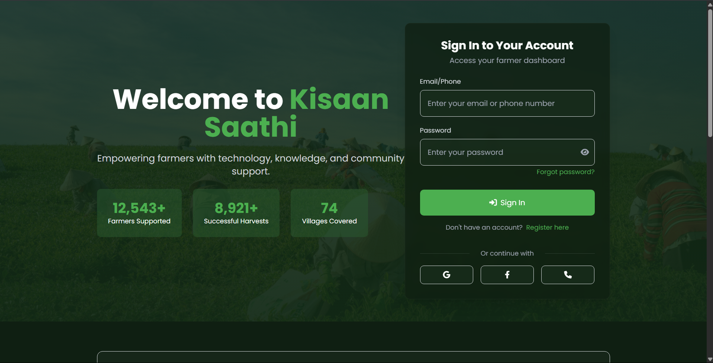
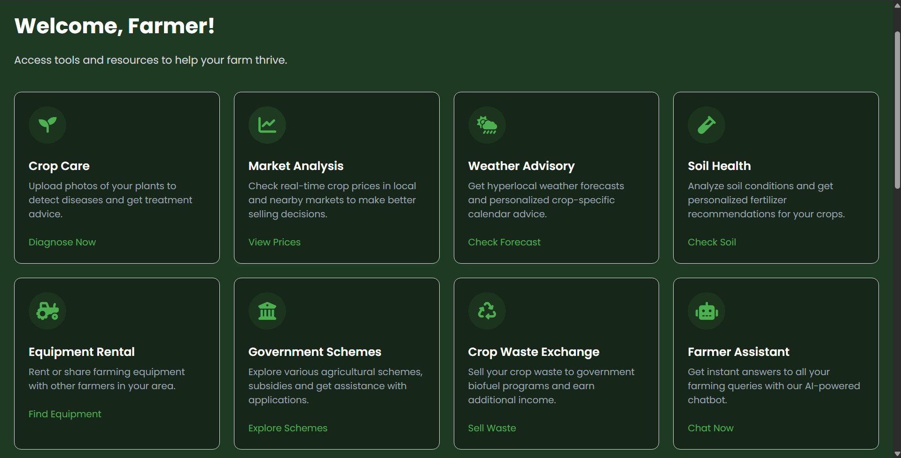
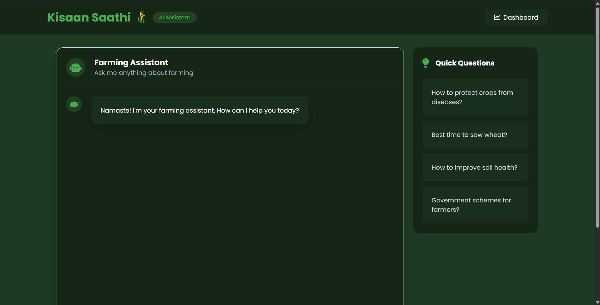
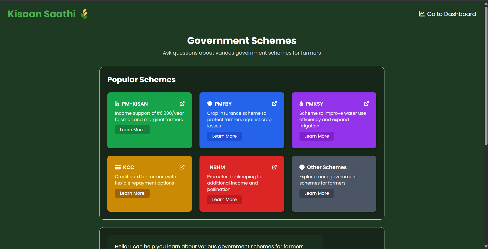

# 🌾 Kisaan Saathi – Empowering Farmers with AI

**Kisaan Saathi** is a comprehensive **AI-powered Farmer Dashboard** designed to support Indian farmers through real-time data, smart decision-making tools, and access to vital resources. From intelligent crop disease diagnosis to market price analysis, equipment rental, and weather forecasting — Kisaan Saathi is your digital companion in the field.

---

## 🚀 Features

### 🧬 Crop Care & Disease Detection  
- Powered by a **custom-trained Xception model** to detect crop diseases across **38 unique categories**.  
- Detected disease details are passed to an **LLM** to generate:
  - ✅ Cause  
  - 🌱 Prevention  
  - 💊 Treatment  
- Equipped with an **AI-powered hotspot mapping system** using **DBSCAN** clustering to:
  - Visualize disease-affected areas.
  - Help **government agencies** prioritize land inspections based on report density.
- **Real-time Processing**: Get instant disease diagnosis with image upload
- **Multi-language Support**: Available in multiple Indian languages

---

### 💧 Water Footprint Calculator
- **ML-Powered Water Requirement Prediction** using a **Random Forest Regressor** model
- Considers multiple factors for accurate water requirement estimation:
  - Crop type and area
  - Regional climate conditions
  - Soil characteristics
  - Irrigation methods
  - Environmental factors (rainfall, temperature, humidity)
- Provides detailed insights:
  - Total water requirement
  - Daily and weekly water needs
  - Customized irrigation recommendations
  - Soil-specific water management tips
- Model Features:
  - Handles both categorical (crop type, soil type) and numerical features
  - Provides real-time predictions through FastAPI backend
  - Adapts recommendations based on local conditions

---

### 🤖 Farmer AI Assistant – Multi-Agent RAG System  
- Built with a **multi-agent architecture** for specialized assistance
- Uses **RAG (Retrieval-Augmented Generation)** with **ChromaDB vector storage** for Mental Health Support
- Ask anything – from farming tips to market advice

---

### 📊 Market Analysis  
- Real-time crop pricing via external **agri-market APIs**
- Features:
  - Price trends visualization
  - Historical data analysis
  - Regional price comparisons
- Helps farmers counter unfair middlemen pricing with live rate insights
- Enables better selling decisions and pricing power

---

### 🏛️ Government Schemes  
- A centralized page for all **ongoing agricultural schemes**
- View **eligibility**, **benefits**, and **application steps** in one place

---

### 🌦️ Weather Advisory  
- Fetches accurate weather updates via **Weather API**
- Features:
  - Weather Forecast
  - Crop calendar and Advice
  - Wind speed monitoring
  - Humidity 
  - Soil Temp

---

### 🔁 Crop Waste Exchange  
- Farmers can **sell/exchange crop waste** for monetary value
- Supports government initiatives for **biogas and biofuel** production

---

### 🚜 Equipment Rental  
- Access to nearby **equipment rental options** at affordable rates
- Makes farming resources more accessible to small and marginal farmers

---

## 🛠️ Tech Stack

### Frontend
- **HTML5** - Semantic markup
- **TailwindCSS** - Utility-first CSS framework
- **JavaScript** - Interactive features
- **Chart.js** - Data visualization
- **Font Awesome** - Icons

### Backend
- **FastAPI** - Modern, fast web framework
- **Uvicorn** - ASGI server

### Machine Learning & AI
- **TensorFlow** - Deep learning framework
- **Scikit-learn** - Machine learning algorithms
- **Xception** - Image classification model
- **Random Forest** - Water requirement prediction
- **DBSCAN** - Clustering algorithm

### AI/LLM Integration
- **LangChain** - LLM application framework
- **LangGraph** - Multi-agent coordination
- **ChromaDB** - Vector storage
- **Groq LLM** - Fast inference
- **Gemini API** - Advanced language model

### APIs & Services
- **Weather API** - Real-time weather data
- **Market Price APIs** - Agricultural commodity prices
- **Gemini API** - Scheme information
- **Groq LLM API** - Tweaked to create Multiple agents for Automation

---

## 📸 Screenshots  

*Interactive Dashboard with Real-time Updates*


*AI-Powered Crop Disease Detection Interface*


*Comprehensive Market Analysis Dashboard*


*Water Footprint Calculator with ML Predictions*

---

## 🚀 Installation & Setup

### Prerequisites
- Python 3.8 or higher
- pip (Python package manager)
- Git

### Step 1: Clone the Repository
```bash
git clone https://github.com/21lakshh/Kisaan-Sathi.git   
cd Kisaan-Sathi
```

### Step 2: Create Virtual Environment
```bash
python -m venv venv
source venv/bin/activate  # On Windows: venv\Scripts\activate
```

### Step 3: Install Dependencies
```bash
pip install -r requirements.txt ##THESE ARE NOT YET ADDED
```

### Step 4: Environment Configuration
Create a `.env` file in the root directory:
```bash
GROQ_API_KEY=your_groq_key_here
DATA_GOV_API_KEY=your_data_gov_key_here
GEMINI_API_KEY=your_gemini_key_here
OPEN_WEATHER_API_KEY=your_weather_api_key_here
```

### Step 5: Run the Application
```bash
python app.py
```

The application will be available at `http://localhost:8000`

---

## 🤝 Contributing

We welcome contributions! Please follow these steps:
1. Fork the repository
2. Create your feature branch (`git checkout -b feature/AmazingFeature`)
3. Commit your changes (`git commit -m 'Add some AmazingFeature'`)
4. Push to the branch (`git push origin feature/AmazingFeature`)
5. Open a Pull Request

---

## 📝 License

This project is licensed under the MIT License - see the [LICENSE](LICENSE) file for details.

---

## 🙏 Acknowledgments

- Farmers and agricultural experts for their valuable insights
- Open-source community for their contributions
- Government agencies for providing agricultural data
- Research institutions for their work in agricultural technology
